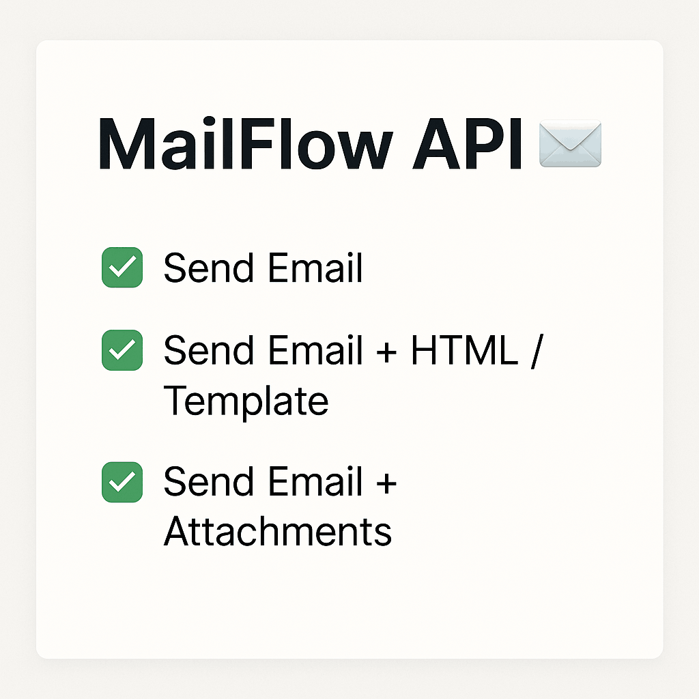

# **MailFlow API** 📨

**API de Envio de Emails com SMTP, JavaMail e Web Integrados**

[](https://www.oracle.com/java/)
[](https://spring.io/projects/spring-boot)
[](LICENSE)

Uma API robusta e escalável para envio e gerenciamento de emails, combinando o poder do **JavaMail**, simplicidade do **SMTP**, ambiente de testes com **Mailtrap** e endpoints web para integração perfeita em aplicações modernas.

---

## **Recursos Principais** 🚀

✅ **Envio de Emails via SMTP**

- Suporte a texto simples, HTML, anexos e templates dinâmicos.
- Configuração flexível para provedores (Gmail, Outlook, Amazon SES) ou serviços locais.

✅ **Testes com Mailtrap**

- Ambiente sandbox integrado para capturar emails em desenvolvimento.

✅ **API Web RESTful**

- Endpoints documentados com Swagger/OpenAPI.
- Logs detalhados de transações (sucessos/falhas).

✅ **Integração JavaMail Simplificada**

- Abstraction layer para evitar complexidades do `javax.mail`.
- Retry automático em falhas de conexão.

---

## **Tecnologias** 🔧

- **Backend**: Java 17+, Spring Boot 3.x
- **Email**: JavaMail API
- **Testes**: Mailtrap, JUnit 5, Mockito
- **Web**: REST, Swagger
- **Outras**: Docker, Maven, Lombok

---

## **Configuração Rápida** ⚡

### 1. **Clonar o Repositório**

```bash
git clone git@github.com:JhonSantt4na/mail-flow-api.git
cd mail-flow-api
```

### 2. **Configurar SMTP/Mailtrap**

Crie um `.env` na raiz do projeto (Ou renomeia o `.env.example` para `.env`):

```properties
MAIL_HOST=sandbox.smtp.mailtrap.io
MAIL_PORT=2525
MAIL_USERNAME=seu_username
MAIL_PASSWORD=sua_senha
MAIL_FROM=noreply@mailflow.dev
```

### 3. **Executar com Docker**

```bash
docker-compose up --build
```

_A API estará em `http://localhost:8080`._

---

## **Como Usar** 💻

### **Enviar Emails via POST**


## **/sendEmail (Email Simples)**

```bash
curl -X POST http://localhost:8080/api/sendEmail \
  -H "Content-Type: application/json" \
  -d '{
    "emailTarget": "destino@exemplo.com",
    "title": "Assunto Simples",
    "message": "Conteúdo texto puro",
    "name": "Remetente"
  }'
```
## **/sendHtml (Email Html)**

```bash
curl -X POST http://localhost:8080/api/sendHtml \
-H "Content-Type: application/json" \
-d '{
"emailTarget": "destino@exemplo.com",
"title": "Assunto HTML",
"message": "<h1>Título</h1><p>Conteúdo <strong>HTML</strong></p>",
"name": "Remetente"
}'
```
## **/sendEmailAnexo (Com Anexo)**

```bash
curl -X POST http://localhost:8080/api/sendEmailAnexo \
-H "Content-Type: multipart/form-data" \
-F "emailDto='{
\"emailTarget\": \"destino@exemplo.com\",
\"title\": \"Assunto com Anexo\",
\"message\": \"Veja o arquivo em anexo\",
\"name\": \"Remetente\"
}';type=application/json" \
-F "anexo=@/caminho/do/arquivo.pdf"
```

